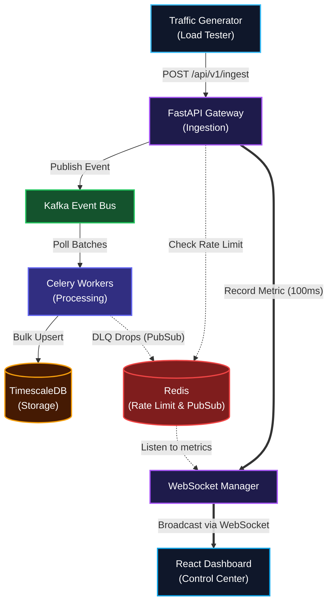

# Pulse Pipeline

> A high-velocity, real-time observability platform and event streaming pipeline designed for production-grade scale.

Pulse Pipeline is engineered to ingest, buffer, and persist immense telemetry data streams. By decoupling the fast ingestion boundary from the downstream storage layer, the system provides high availability and zero data loss under massive traffic spikes, all while giving operators a live, tactical view of system health and throughput.


*Figure 1: Pulse Pipeline Overview - High-performance distributed telemetry ingestion architecture, showcasing decoupled event streams, rate limiting, and real-time visualization.*

---

## 🏗️ Architecture

Pulse utilizes a distributed, resilient architecture to guarantee data durability and provide sub-second observability:

1. **FastAPI Ingestion Gateway:** Validates incoming JSON payloads at the edge and enforces sliding-window rate limits via Redis.
2. **Kafka Event Bus:** Acts as the central nervous system, absorbing traffic spikes and buffering events into partitions to protect downstream databases from lockups.
3. **Celery Workers:** A fleet of decoupled background consumers that poll Kafka and perform highly optimized bulk upserts.
4. **TimescaleDB:** A robust PostgreSQL extension tailored for time-series data, acting as the final cold storage.
5. **WebSocket Dashboard:** A React frontend that connects to the FastAPI backend via WebSockets. It receives a 100ms batched metric stream to render the live data topology without succumbing to backpressure.


*Figure 2: Infrastructure Status Monitor - Live health checks and connection state verification for Kafka, Redis, and TimescaleDB containers.*

---

## ✨ Key Features

- **Pipeline Latency Tracker:** Inject UUIDs into the traffic simulator and measure exact Round Trip Time (RTT) across the entire distributed pipeline, visualizing it directly on the dashboard.
- **Causality Diagnostics:** Detailed error reporting prevents silent failures. Dropped events (e.g., DLQ failures, rate limits) trigger alerts via Redis PubSub, broadcasting the failure reason straight to the frontend.
- **System Health Widget:** Active polling constantly checks the status of Redis, TimescaleDB, and Kafka, illuminating red or green indicator dots to immediately surface infrastructure outages.
- **Anti-Backpressure UI:** The frontend leverages `@xyflow/react` and custom HTML5 canvas rendering to visualize thousands of events per second without crashing the browser.

---

## 📊 System Visualization


*Figure 3: Real-Time Tactical Control Center - The GPU-accelerated HTML5 Canvas rendering dashboard showing live network throughput, partition workloads, and node latencies.*

---

## 🛠️ Tech Stack

- **Backend:** Python, FastAPI, Celery
- **Message Broker:** Apache Kafka, Zookeeper
- **Caching & PubSub:** Redis
- **Database:** PostgreSQL with TimescaleDB
- **Frontend:** React, TypeScript, Tailwind CSS, React Flow

---

## 🚀 Quick Start

Ensure you have **Docker** and **Docker Compose** installed.

1. **Clone the repository:**
   ```bash
   git clone https://github.com/yourusername/pulse-pipeline.git
   cd pulse-pipeline
   ```

2. **Launch the infrastructure:**
   This command starts the API gateway, Celery workers, and all required infrastructure components (Kafka, Redis, TimescaleDB).
   ```bash
   docker compose up -d --build
   ```

3. **Start the tactical dashboard:**
   In a separate terminal, navigate to the frontend directory to run the UI.
   ```bash
   cd frontend
   npm install
   npm run dev
   ```

4. **Observe:**
   Open `http://localhost:5173/` in your browser. Use the Load Tester module to simulate a massive traffic spike and watch the system absorb it.


*Figure 4: API Gateway Ingestion - The FastAPI `/api/v1/ingest` interface, designed for sub-5ms payload validation and edge token-bucket throttling.*

---

## 📚 Documentation

### Architecture Diagram



---

## ✅ System Verification

The pipeline has been rigorously validated for **at-least-once** data delivery guarantees. 

Our automated End-to-End (E2E) integration test verifies the entire asynchronous data flow. The smoke test uses `pytest` to inject 100 uniquely correlated mock events directly into the Kafka ingestion topic, waits for the decoupled consumer daemon to process the batch, and asserts that exactly 100 records are successfully persisted in the TimescaleDB hypertable without data loss or duplication.

To run the verification suite:
```bash
docker compose exec api pytest tests/test_e2e_integration.py -v -s
```

**Status:** `[PASSED]` (2026-06-24)

### Historical Log Persistence


*Figure 5: Historical Logs & Persistence - Cold storage query analytics and audit trail of ingested events verified in TimescaleDB database.*

### Volumetric Load Testing


*Figure 6: Volumetric Load Tester - High-throughput traffic generator simulating spike injections of up to 5,000 requests per second to evaluate pipeline backpressure.*
